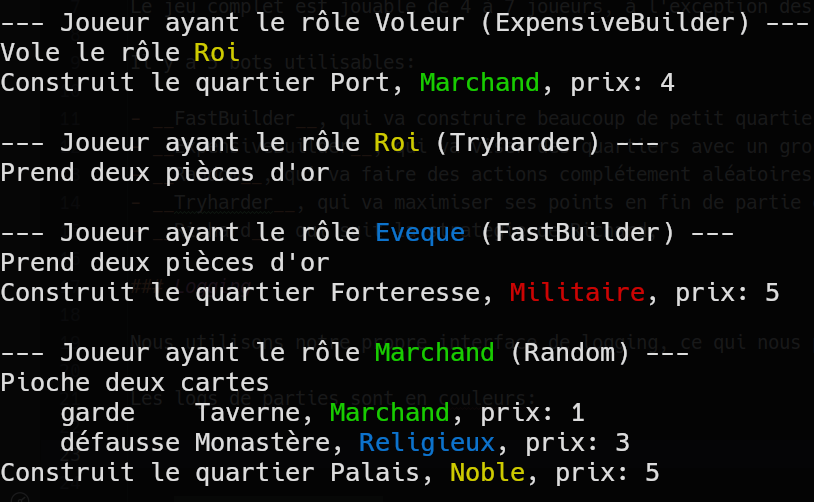

# Rapport

## 1. Point d'avancement

### Fonctionnalités réalisées

Le jeu complet est jouable de 4 à 7 joueurs, à l'exception des merveilles (il n'y en a que deux : Donjon et Ecole de magie). Tous les pouvoirs des personnages sont utilisables.

Il y a 5 bots utilisables:

- __FastBuilder__, qui va construire beaucoup de petit quartier ainsi que ne jamais choisir le même rôle deux fois d'affilées
- __ExpensiveBuilder__, qui va viser des quartiers avec un gros score,
- __Random__, qui va faire des actions complétement aléatoires,
- __Tryharder__, qui va maximiser ses points en fin de partie grâce à diverses méthodes, va habilement utiliser les pouvoirs de ses personnages pour augmenter son score et va choisir son rôle notamment en prenant en compte les catégories de ses quartiers construits pour maximiser l'or gagné.
- __Richard__, qui suit la stratégie de Ricard,

### Logging

Nous utilisons notre propre interface de logging, ce qui nous permet de supprimer les logs facilement.

Les logs de parties sont en couleurs :

### Statistiques en CSV

Nous utilisons la librairie OpenCSV pour lire et écrire les fichiers CSV.

### Richard

Nous avons implémenté une partie de la stratégie de Richard, notamment le fait d'empêcher un joueur bientôt gagnant de prendre l'architecte, ou essayer de tuer l'architecte en prenant l'assassin.

## 2. Architecture et qualité

### Architecture

Dès le début du projet, nous avons fait attention à isoler le comportement des bots de la logique de jeu pour éviter toute triche. Les bots ne peuvent pas accéder et/ou modifier des informations et éléments propres au jeu. Cela se fait via les classes View, qui permettent un accès en lecture personalisé du bot par rapport au jeu.

Tout bot doit implémenter l'interface [`Behavior`](https://github.com/pns-si3-projects/projet2-ps-23-24-citadels-2024-s/blob/master/src/main/java/com/github/the10xdevs/citadels/interaction/behaviors/Behavior.java) pour pouvoir jouer au jeu. Il serait en théorie possible de publier notre projet en tant que librairie, et n'importe qui pourrait importer la librairie, implémenter son propre bot et lancer une partie avec son bot.

### Documentation

Il n'y a pas de fichier de documentation dédié, mais nous avons écrit de la Javadoc dans la majeure partie du projet. Nous avons fait ça pour se plier à la documentation standard de Java ce qui a donc permis d'avoir de la documentation et de l'aide integrée dans nos IDE.

### Qualité

Nous sommes plutôt confiant de la qualité du code, à peu près tout est bien fait. Les parties de AbilityAction sont peut-être trop complexes et pourraient être refactor. Nous avons produits une grande quantité de tests unitaires, allant de tests isolés pour vérifier que certaines petites méthodes font ce qu'elles sont censées faire jusqu'à des gros tests avec mise en situation pour vérifier le comportement de nos bots. De plus, nous avons régulièrement cherché à minimiser les divers warnings de SonarLint et SonarQube pour tenter de maintenir le code le plus propre possible.
Et pour obtenir une rapide idée de la qualité du code que les autres membres de l'équipe ont produit, nous avons implémenter une Github action qui compile, tente de passer les tests et de lancer une game, pour attester que tout va plutôt bien.

## 3. Processus

### Qui a fait quoi ?

Romain s'est occupé de l'architecture initiale. Pour la suite sur projet, tout le monde a un peu touché à tout.
Logan s'est occupé du deck et du bot __Tryharder__.

### Process

Nous avons utilisé GitHub Flow pour nous organiser (master est toujours stable, une pull-request par feature). Nous pensons que c'est la git branching strategy la plus simple tout en gardant un master stable pour être capable de présenter un Minimum Viable Product lors, par exemple, des démos hebdomadaires.
